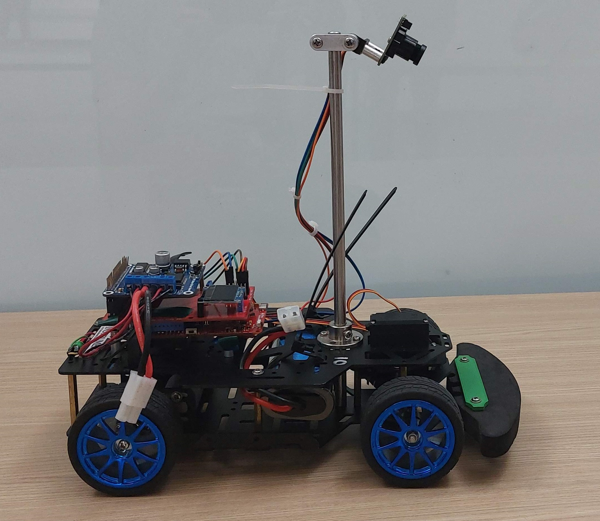
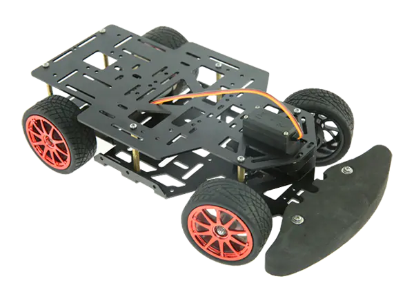
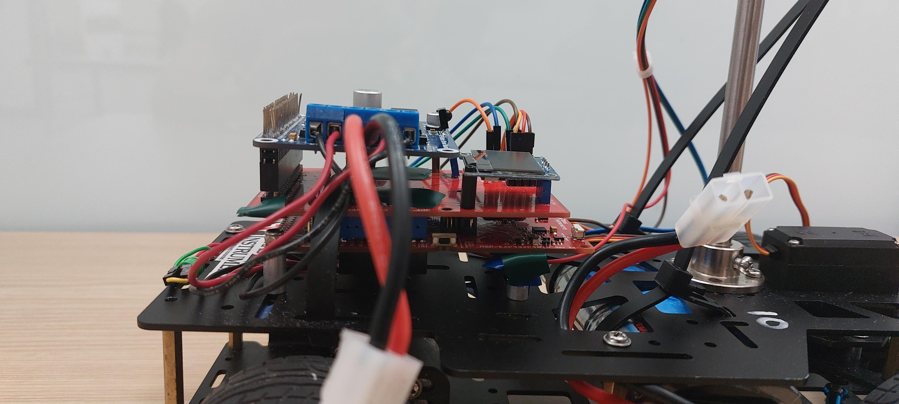
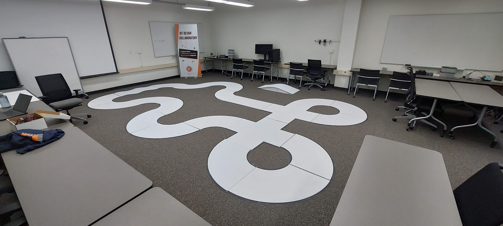

# TI Cup Autonomous Racecar

TI MSP432 programmed using embedded C to control an autonoumous 1/18-scale car to navigate a [randomized track](#fig-6-race-day-track-configuration-with-failure-points-marked). 

https://github.com/atticusrussell/CMPE460_Car_Project/assets/60147768/7029acdb-6165-4c12-b1d5-a47e141b8409

Final project for the course Interface and Digital Electronic (IDE), CMPE-460, in the Computer Engineering (CE) department at Rochester Institute of Technology (RIT). The ultimate assessment is a time-trial race in which teams compete for the shortest lap time around a randomized track configuration. This competition is referred to as the "TI Cup" (formerly NXP Cup). See [the rules](/docs/RIT-NXP%20Car%20Rules.pdf) for more information on the contest.

 More Hardware Info 

The cars were constructed using components previously used in the NXP cup that have been adapted to work with the TI board provided in this project.

### Base

The base of the car is the [DFROBOT ROB0170](https://www.mouser.it/ProductDetail/DFRobot/ROB0170?qs=hWgE7mdIu5TqrtXq%252BmF5EA%3D%3D) NXP Cup Race Car Chassis. [NXP Site](https://nxp.gitbook.io/nxp-cup/dfrobot-chassis-developer-guide-2019/assembly/dfrobot-chassis). The chassis is constructed from two aluminum plates separated by standoffs. This construction yields a certain degree of protection to components mounted securely between the plates, such as the battery.

 The car is rear-wheel drive; a pair of brushed DC motors drives each rear wheel independently. The angle of the front wheels is determined by a hobby-grade TowerPro MG996R plastic-geared servo connected to a steering linkage. 

### Electronics
The car is controlled using a TI MSP432P4111 microcontroller. This is connected to the other components through a custom shield PCB developed by the CE department that adapts the headers of the TI MSP432 board to the correct pins for the [RPi Motor Driver Board](https://www.waveshare.com/rpi-motor-driver-board.htm) (intended as a shield for Raspberry Pi GPIO headers), and provides labeled pins to connect the camera, servo, and OLED. The RPi Motor Driver Board additionally converts the battery voltage to 5v for the MSP432 and other electronics. The battery is a Tenergy 7.2V 3800mAh NiMH. 

## Track
#### Practice track configuration

# Report: 2 Fast 2 Be Serious

**Atticus Russell & Erica Coles**

*Rochester Institute of Technology*

---

## Abstract

Autonomous vehicles are a novel technology being intensely researched and invested in at this current time. At the Rochester Institute of Technology, the Texas Instruments Cup competition was an opportunity for computer engineering students to apply the skills and knowledge acquired through their coursework to program a small autonomous car to autonomously traverse a racetrack. The major components making up the vehicles used in the competition were a Texas Instruments MSP432 microcontroller, two DC motors to spin the rear wheels for propulsion, a servo for steering the front two wheels, and a 128-pixel line-scan camera with which to perceive the track. The constructed cars of each team competed in a time trial race against cars developed by other teams of students.

---

## Introduction

The goal of competitors in the Texas Instruments (TI) Cup was to design the fastest autonomous car that could complete a lap of an unknown track configuration in a time trial against several other cars. A total of 14 teams of two students were each provided with a TI Cup car kit to assemble, program, and compete with in the race. This kit consisted of a TI MSP432 Microcontroller, a car chassis with four wheels; the rear two driven by two DC motors, and the front two steered using a servo and some steering linkage hardware. The kit also included two batteries for the car, a motor driver shield, a custom board to interface the MSP432 with the motor driver and the other components, a line-scan camera on an adjustable mount to be raised above the car on a pole, and other miscellaneous components. The assembled vehicle is shown in [Fig. 1](#fig-1-the-ti-cup-car).

#### Fig 1: *The TI Cup Car*[^CarPhoto^]

The specifications of the race were as follows: each team was provided three attempts to complete a full lap of the track, and the first time the car completed a lap was recorded as the official time, and no subsequent attempts to improve the time were allowed. A successful completion of a lap of the track requires that the car has at least two wheels on the track at all times, and completes the lap in less than 60 seconds. The official race track structure as shown in Fig. \ref{fig-trackCorner} was not made known to students until the day of competition. Each  team was allotted 5 minutes of practice time on the competition track prior to the race for further adjustments and tuning.  Timing began when a vehicle broke the beam of a laser-triggered timer at the start line, and ended when it successfully makes a lap around the track and broke the beam a second time. Students were allowed to adjust the camera, use the board's buttons, and change batteries in between attempts, but not to flash new code or make other modifications. 

The TI Cup competition was a chance to apply the skills learned throughout the Interface and Digital Electronics course of Rochester Institute of Technology's Computer Engineering department. Laboratory exercises throughout the course centered on programming a TI MSP432 microcontroller to accomplish various tasks. Some of the previous exercises were extremely relevant to the TI Cup, such as Exercise 5, where students used the Timer32 module of the MSP432 to process data from a line-scan camera [^ex5^]. Also relevant was Exercise 6, where students used the MSP432's TimerA module to implement pulse-width modulation (PWM), and used the PWM functionality to control a DC motor using an H-Bridge, and to directly control a servo [^ex6^].

This team's goal in the project was to write code for the MSP432 that would allow our TI Cup car to complete a lap of the track in the minimum possible time during the competition. The plan to achieve this was to write reliable and modular C code to control the different components involved in driving, and to write the code in a way allowing different aspects of the car's behavior to be configured through the use of "modes", and different features to also be quickly disabled and re-enabled to ease optimizing the car during development. Through this approach, the intent was to run the car at the maximum possible speed at which it could complete the course, as determined by trial and error, and the use of a modal system would allow the availability of a lower-speed mode to help ensure the successful completion of a lap if the first two attempts were to fail.

The rest of this paper is organized as follows. [Section 2](#background) reviews the development process leading up to the competition, strategies of past teams during the TI and NXP Cups, our strategy for implementing a steering algorithm, and further details the components of the car. [Section 3](#proposed-method) explains the method implemented in the design of the car, and elaborates on our unique approaches. [Section 4](#results) presents the experimental results of late testing and the race, and [Section 5](#conclusion) contains concluding remarks.

## Background

### Milestones

The development of this project was divided into three milestones leading up to to the final race. The first milestone was to make the car capable of driving in either direction around a small white oval track, and to detect carpet and stop promptly if it detected it had left the track.  For the second milestone, the car was tested for its ability to navigate intersections utilizing a figure-eight track. The final milestone was the implementation and demonstration of a proportional-integral-derivative (PID) control algorithm in part of the car’s code.

### Components

A multitude of components were used to construct the car, and are listed in the Bill of Materials (BOM) in [Table 1](#table-ti-cup-car-bill-of-materials). The Texas Instruments MSP432 microcontroller, also known as the microcontroller unit (MCU), was used to control all other components, and was connected to a custom-made interface board. This interface board plugged into the headers on top of the MSP432 and connected the appropriate pins of the microcontroller to a RPi MC33886 motor driver board, while exposing the pins required to interface with the servo, and those to connect to the line-scan camera as shown in Fig. 1. The RPi driver board connected to the battery, and, in addition to driving the DC motors on the rear wheels of the car, provided the MSP432 with the regulated 5 volt supply required for it to run while on battery. The MCU was connected electrically through the interface board to the MG996R servo motor, which was connected to the front wheels through the use of a steering arm. The brushed DC motors on the rear wheels of the car were from DFRobot’s KIT0167. The car was powered using a Tenergy 7.2V 3800 mAh Battery Pack, which was held to the chassis using the zip ties. The MCU was additionally connected to the Parallax TSL1401-DB Line-Scan Camera Module through the interface board.

#### Table: TI Cup Car Bill of Materials [^BeatoBom^]

| **Part** | **Name** | **Qty** | **Price** |
| --- | --- | --- | --- |
| Line Scan Camera | Parallax TSL-1401 | 1 | \$80.00 |
| Servo Steering Arms |  | 1 | \$17.99 |
| Motor Driver | RB-WAV-77 | 1 | \$28.99 |
| Chassis Kit | ROB0170 | 1 | \$98.75 |
| Brushed Motor Kit | KIT0167 | 1 | \$25.00 |
| OLED Display | UCTRONICS 12864 | 1 | \$6.99 |
| Bluetooth | HM-10 | 1 | \$10.99 |
| Battery | Tenergy 7.2V 3800mAh NiMH | 2 | \$39.99 |
| Battery Charger | Sourcingpower Universal RC Charger | 1 | \$19.99 |
| Camera Ribbon Cable | Fielect 5Pcs F to F 6 Pin Breadboard Jumper Wire | 1 | \$6.69 |
| Power Connector | Tamiya Male Adapters Cable with 10cm 14awg | 1 | \$8.68 |
| Zip Ties | Reusable Zip Ties | 1 | \$18.99 |

### Previous Efforts
Prior to the TI Cup, students competed in a similar competition called the NXP Cup. The objective of the two races are the same in which students program an autonomous car to compete for the fastest time around an unknown track. The main difference is that an ARM FRDM-K64F microcontroller was used in the NXP Cup [^NXPPaper^], while a TI MSP432 microcontroller, which also utilized an ARM processor, was used in the TI Cup.

In previous competitions similar to the TI Cup, students competing in the TI Cup utilized an algorithm that applied a binary filter on the line-scan data and used the average of those values to establish a threshold that determined the course of the car. The car stopped when the amount of data points went under the threshold and used the average of the data points to steer the car along the track when the points were above the threshold [^HarrisonPaper^].

Another method a previous team used is the bang-bang strategy in which the car is programmed to adjust its speed automatically depending on the consistency of its navigation. The implementation of this method allows the car to control its speed when it determines a pattern in the types of turns or directions it is going in, however, it is not a sophisticated control method and is not suitable for higher speeds [^DantePaper^].

### PID Control
PID is a control algorithm that uses feedback to control systems. The algorithm calculates the error between the desired output and the actual output of the system and applies corrective actions to bring the output closer to the desired value. The three terms in the algorithm, Proportional, Integral, and Derivative, represent different aspects of the error and are used to calculate the corrective action. [Fig. 2](#fig-2-pid-controller-block-diagram) displays a block diagram of a PID controller in a closed feedback loop.

#### Fig. 2: *PID Controller Block Diagram*[^pidDiagram^]

A quirk of PID control is that it is not always necessary to implement all three of the components, depending on the application. Some systems may only require the use of proportional control, and others may only require proportional and integral or proportional and derivative to reach the desired behavior of the system.

### Line-Scan Camera
The Parallax TSL-1401 line-scan camera used in the TI Cup car's design is a critical component, as it is the car's only source of information about its environment, and so data from it forms the basis for all of the car's actions. The line-scan camera measures 128 pixels of light intensity in a horizontal line. The camera must be positioned at a high enough above the track to see an adequate section of what is ahead of the car, and its angle must be adjusted precisely so that it sees the desired part of the track.

The line-scan camera has two input signals, CLK and SI, and one analog output signal, A0. In order to initiate data transfer from the TSL-1401R camera, SI must go high for a brief duration (less than one period of CLK). This triggers the clocking out of data from the previous exposure on A0 (the timing of which is determined by CLK) and triggers the next exposure to begin. The 128 pulses of CLK following the pulse on SI define the time that the values captured by each of the 128 photodetectors during the previous exposure is read out on A0. This cycle repeats. The interval between the pulses on SI determines the exposure time [^ex6^]. The integration time used for our car was 20 ms. The timing diagram in [Fig. 3](#fig-3-line-scan-camera-timing-diagram) illustrates the described sequence of signals.

#### Fig. 3: *Line-Scan Camera Timing Diagram*[^cameraTiming^]

The ADC (Analog to Digital Converter) on the MSP432 microcontroller digitizes each of the voltages output on A0 so that they can be used by the processor. When the car is on, the line-scan camera is continuously running to update the information about the car's environment. The location of the connections to the line-scan camera is displayed in [Fig. 4](#fig-4-wiring-diagram-for-line-scan-camera).

#### Fig. 4: *Wiring Diagram for Line-Scan Camera*[^labManual^]

### DC Motors
The two brushed DC motors interfaced with the MCU through the RPi MC33886 motor driver board. The driver board consisted of two H-bridges, one for each motor, that allowed the motors to be controlled without damaging the MCU, due to the high current demands of the DC motors. Additionally, the H-bridges allowed the direction of the motors to be controlled through swapping the direction that current flows through the motor. The MCU used Timer A0 to set the PWM duty cycle of the two pairs of MSP432 output pins connected to the motor driver board to control the speed of the DC motors.

### Servo
The servo was controlled using PWM (pulse width modulation) at a frequency of 50 Hz (20 ms PWM period), which was implemented on the MSP432 board through the use of Timer A2. For this servo, the total range of motion was 120 degrees. Setting the PWM duty cycle to 5% turned it fully to the left, 7.5% centered it, and 10% turned the servo fully to the right.

## Proposed Method
### Visual Center of Mass
The line-scan camera pixel index corresponding to the center of the track was determined by processing the raw data obtained using the line-scan camera connected to the A2D (Analog to Digital converter), which consisted of 128 values ranging from zero to 65,535 (in practice on the track approximately 15,000 was the max. value seen), corresponding to the magnitude of light intensity seen by each pixel. The raw data was processed in two steps, first smoothing, done to reduce the effect of visual noise in the data, and then summing. Smoothing the data was done through applying a five-point moving average of the 128 luminance magnitudes, by averaging the value of each pixel with the two on either side of it. [Fig. 5](#fig-5-raw-and-filtered-line-scan-camera-data) shows the effect of applying a smoothing filter to raw data from the line-scan camera. 

#### Fig. 5: *Raw and Filtered Line-Scan Camera Data*[^ex5^]

After the data had been smoothed, the index of the visual center of mass was then determined by summing the magnitudes of the smoothed data and summing the indices of the data points which were weighted by the position in the array. The index of the visual center of mass was then found by dividing the weighted index sum by the summed magnitudes. The index of the visual center of mass corresponded to the center of the track.

$$X_{center} = \sum_{i=1}^{n} \frac{mx}{M}$$

### Carpet Detection
To detect if the car was on carpet instead of the track, the magnitude of the smoothed data at the index corresponding to the visual center of mass was compared to a constant threshold value. If the magnitude at the visual center of mass was less than the predetermined threshold value, the car was determined to be on the carpet and was stopped accordingly.

### Servo Steering
A function was written to convert an angle in degrees into an equivalent duty cycle and to modify the duty cycle of the PWM signal sent to the servo accordingly. The difference in angle from the center line of the car to the center of the track was determined by subtracting the index of the visual center of mass from 64, which was half of the range of the pixels, and then multiplying the result by a steering scalar. The scaled difference was used to set the steering in degrees.

### Servo PID Control
An algorithm for applying PID control to the steering of the front wheels was developed. The algorithm took the desired difference in angle to the center of the track (always zero degrees) and the actual angle to the center of the track, as calculated in the regular steering function. The algorithm outputted the optimal number of degrees to steer the servo. The PID algorithm kept track of the three prior steering errors and used values for Kp, Ki, and Kd determined through testing.

$$u(t) = K_p e(t) + K_i \int_{0}^{t} e(\tau) d\tau + K_d \frac{de(t)}{dt}$$
### Speed Control
The speed was set to a constant duty cycle that allowed the car to safely get around all turns of the track. This duty cycle was found through experimentation and was about 38%.

During the preparation for the race, a method of scaling the speed by the straightness of the ahead track was devised. The magnitude at the visual center of mass was taken and divided by a scalar, and the base speed was multiplied by the resulting scalar. This method allowed the car to accelerate to a higher speed on straights but maintain a controllable speed when in corners.

### Differential Thrust
Differential thrust for turning was implemented in the design to supplement the limited range of motion inherent to the steering servo, which limited the maximum steering angle to 60 degrees. The differential thrust aids in turning the car by slowing the rotation speed of the inner wheel by an amount proportional to the severity of the turn, by reducing the speed of the motor driving that wheel. The speed of the outer wheel was slightly increased in proportion to turn severity.

### Driving Modes
Three driving modes were implemented, each with a different level of tested reliability in completing the course successfully. The modes were "reckless", "balanced", and "conservative". Reckless mode drove the car at the highest reasonable speed, balanced mode put the car at the normal speed, and conservative mode brought the car to the lowest speed. Each mode corresponded to a particular set of car settings that modified items such as base speed, turning scalar, and enabled or disabled certain functionality like PID steering, differential thrust, and scaled speed controls.

The driving modes were cycled through using a button on the MSP432, and the selected mode was indicated using the RGB LED on the board. Reckless mode had the highest base speed and nearly all features enabled, including PID steering. Balanced mode had a slightly lower base speed and all features enabled except for PID steering. The conservative mode disabled all but the most basic features and used a fixed speed.

### Additional Functionality
Arming and disarming functionality was implemented to avoid accidents when flashing or operating the car. When the car was disarmed, the DC motors and the servo were disabled, and when it was armed, they were enabled. A button on the MCU was used to toggle between armed and disarmed states. The status of the car was indicated using LED1. When disarmed, LED1 was off, and when armed, it was turned on. A 1.5-second delay was added when transitioning from disarmed to armed, during which time LED2 would countdown by turning red, yellow, and then green when the car was in the armed state.

When not being used for mode selection or countdown, the color of LED2 was set based on the magnitude of the visual center of mass value to provide usefu l insight about the car's perception during development and tweaking the camera position.

## Results
Prior to race day, our car appeared poised to place in the top three spots during the race. During testing, across all of the different track configurations, our car, operating in balanced mode, had set the fastest unofficial times in a very consistent manner, when compared to other teams benchmarking and timing their cars.

Knowing that the camera position was extremely important and sensitive to the performance of the car, we did not remove or adjust the camera between testing sessions and the day of the race. Despite this, when our five-minute practice session arrived on the day of the race, the car drove straight off the edge of the track. This is still unexplained, and we do not have any significant theories as to why this occurred. The most probable explanation is that we had not yet had a test track set up in the part of the room where the start line was, so the lighting could have been different, but this seems implausible, as we did all testing in that room, and the lighting seemed rather uniform.

After not completing a single lap during our five-minute practice session, we had to come up with a solution during the 40 minutes until the race. We set up an improvised test track outside of the race room using the few scrap pieces of track left over, which were mostly straight pieces, and adjusted the camera and parameters in the code, such as reducing the base speed of all modes to 35% duty cycle, so that it could successfully navigate the improvised track. At that point, our only goal was to complete a lap at a modest speed, which would still place us in the top seven teams. We also lowered the maximum speed to 40% duty cycle because we tuned on the improvised track in a dimly lit area, so we wanted to avoid the car going uncontrollably fast due to speed scaling with visual center of mass in the much brighter race room. We ultimately had to just hope that the modifications and tuning done on the improvised track would translate to the official one.

The configuration of the track on the day of the race consisted of two large loops consisting of several turns, one small loop, two intersections, and a hill, as shown in [Figure 6](#fig-6-race-day-track-configuration-with-failure-points-marked).

#### Fig. 6: *Race Day Track Configuration With Failure Points Marked*[^HarrisonTrackPhoto^]

In the race, the car did not ultimately complete a lap around the track. In the first run, our car left the track for some unknown reason. In the second run, we set the mode to balanced, and the car made it quickly and smoothly about halfway around the track, however, it ran off the track in the marked position on [Figure 6](#fig-6-race-day-track-configuration-with-failure-points-marked), which is marked with the points where each run left the track. The cause of this is assumed to be the line-scan camera being angled too high, with the camera seeing too far ahead of the car, causing the car to drive off course towards a different part of the track rather than stay on the continuous course. Run three had the same result, as in the high-pressure situation of the race, we did not think clearly enough to angle the camera further down between runs two and three. The improvised test track that we created and tuned on did not have the requisite turn pieces to emulate that section of the track, so going into the race, we were not aware of the dangers posed by having the camera angle too high and seeing other runs of track nearby.

## Conclusion
Ultimately, this car did not place in the top seven in the TI Cup, nor did it finish a full lap, but the design was successful in completing the three milestones prior to the race and was fast and consistent in the days leading up to the race. Minor modifications to the physical placement of the line-scan camera would likely improve results in the future. The TI Cup was a beneficial opportunity for students to apply their classroom knowledge and problem-solving abilities in a real-world application.

[^CarPhoto^]: A. Russell, Photo of TI Car. 7 Dec. 2022
[^HarrisonPaper^]: H. Barnes, B. Wrighter, "Designing Autonomous Driving in the 2021 Texas Instruments Cup", 07-Dec-2022.
[^BeatoBom^]: L.J. Beato, private communication. 6 Dec. 2022
[^pidDiagram^]: Y. Yang, "Introduction to PID Control Loops". Erdosmiller, 03-Mar-2022. [Online]. Available: [https://info.erdosmiller.com/blog/introduction-to-pid-control-loops](https://info.erdosmiller.com/blog/introduction-to-pid-control-loops)
[^cameraTiming^]: Line Scan Camera Use. (n.d.). NXP Community. [Online]. Available: [https://community.nxp.com/t5/University-Programs-Knowledge/Line-Scan-Camera-Use/ta-p/1105313\#toc-hId--1874155339](https://community.nxp.com/t5/University-Programs-Knowledge/Line-Scan-Camera-Use/ta-p/1105313\#toc-hId--1874155339)
[^labManual^]: L. Beato. "CMPE-460 Interface & Digital Electronics Laboratory Manual". Department of Computer Engineering, Rochester Institute of Technology
[^ex5^]: A. Russell, E. Coles, "CMPE-460 Laboratory Exercise 5, MSP432 Timers, Interrupts, and Analog-to-Digital Converter", 9 Oct. 2022.
[^ex6^]: A. Russell, E. Coles, "CMPE-460 Laboratory Exercise 6, Motor Control", 19 Oct. 2022
[^HarrisonTrackPhoto^]: H. Barnes, Photo of NXP Cup Track. 3 Dec. 2022
[^DantePaper^]: D. Sivo, A. Tarmu, "Demonstration of Small Autonomous Vehicles Through the Texas Instruments Cup", 07 Dec 2022.
[^NXPPaper^]: L. Burnette and K. Carlile, "The NXP Cup; Building an Autonomous Racecar," 5 May 2021.
