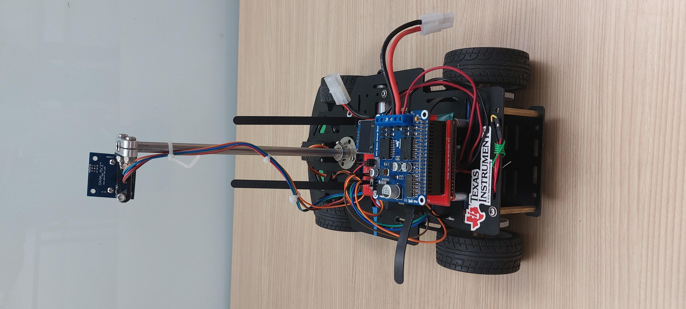

# TI Cup Autonomous Racecar

## Background
Final project for the course Interface and Digital Electronic (IDE), CMPE-460, in the Computer Engineering (CE) department at Rochester Institute of Technology (RIT). IDE students learn throughout the course to interface various peripherals with a TI MSP432 microcontroller using embedded C programming. The knowledge learned during IDE is tested by the term project, where an TI MSP432 board is used to control an autonoumous 1/18-scale car to navigate a scale track constructed from plastic segments.

 IDE students are split into teams of two, and each team is provided with standardized components for an autonomous model car. Teams assemble, program, and tune their cars with the goal of navigating the plastic racetrack as quickly as possible. The ultimate assessment is a time-trial race in which teams compete for the shortest lap time around a randomized track configuration. This competition is referred to as the "TI Cup" (formerly NXP Cup).

## Hardware
The cars are constructed using components previously used in the NXP cup that have been adapted to work with the TI board provided in this project.

### Base

The base of the car is the [DFROBOT ROB0170](https://www.mouser.it/ProductDetail/DFRobot/ROB0170?qs=hWgE7mdIu5TqrtXq%252BmF5EA%3D%3D) NXP Cup Race Car Chassis. [NXP Site](https://nxp.gitbook.io/nxp-cup/dfrobot-chassis-developer-guide-2019/assembly/dfrobot-chassis). The chassis is constructed from two aluminum plates separated by standoffs. This construction yields a certain degree of protection to components mounted securely between the plates, such as the battery.

 The car is rear-wheel drive; a pair of brushed DC motors drives each rear wheel independently. The motors are driven by a "RPi Motor Driver Board"  The angle of the front wheels is determined by a hobby-grade TowerPro MG996R plastic-geared servo connected to a steering linkage. 

### Electronics
The car is controlled using a TI MSP432P4111 microcontroller. This is connected to the other components through a custom shield PCB developed by the CE department that adapts the headers of the TI MSP432 board to the correct pins for the RPi Motor Driver Board shield (intended for Raspberry Pi GPIO headers), and provides labeled pins to connect the camera, servo, and OLED.

### Camera

## Results

## Car Images

